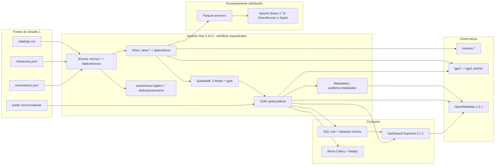

# Arquitetura do Desafio 2 — ETL, ELT ou híbrida (RF19)

## 1. Fluxo das fontes ao consumo

## 2. Onde acontece cada letra

| Etapa | Onde | O que acontece |
|---|---|---|
| **E**xtração | `bronze_catalogo.hpl`, `bronze_interacoes.hpl`, `bronze_comentarios.hpl` | Lê CSV e JSON de `dados/brutos/`, tudo como texto, e acrescenta `origem`, `arquivo_origem`, `data_hora_ingestao`, `execucao_id`. |
| **L**oad (1ª carga) | `bronze.*` no PostgreSQL + `dados/bronze/` | Carga crua, sem transformação destrutiva. |
| **T**ransformação | `silver_*.hpl` (SQL dentro do Table Input, executado no banco) | Tipagem, domínio, deduplicação por chave de negócio, referência a `silver.conteudo`, quarentena. |
| **T**ransformação | `qualidade.aplicar`, `gold.publicar` (funções no banco, chamadas pelo Hop) | Testes de qualidade, gate crítico, agregações da Gold. |
| **T**ransformação | `beam/pipeline.py` | Mesma agregação da `gold.fato_engajamento_dia` sobre Parquet, no DirectRunner e no Spark. |
| **L**oad final | `gold.*`, `mestres.*`, `lgpd.conteudo_publico` | Tabelas de consumo lidas pelo Superset (papel `leitor_bi`). |

## 3. Classificação: híbrida, com predominância ELT

- **ELT** no fluxo principal: o dado é carregado cru no Bronze (dentro do PostgreSQL) e as transformações Silver e Gold rodam **no próprio banco** (SQL executado pelo Hop e funções `qualidade.*` / `gold.publicar`). O Hop orquestra, mas quem transforma é o motor SQL.
- **ETL** em dois pontos: o Hop grava arquivos Silver e de quarentena em disco durante o fluxo, e o Beam extrai a Silver, transforma fora do banco e grava Parquet.

### Justificativa

| Critério | Por que híbrida/ELT |
|---|---|
| Custo | Um PostgreSQL já existia no Desafio 1. Transformar dentro dele evita um motor extra; o Spark só entra onde o RF25 exige. |
| Governança | O Bronze guarda o dado original com auditoria, então toda linha Silver/Gold é rastreável até o arquivo e a execução (`execucao_id`). A quarentena guarda `payload_original`. O OpenMetadata lê tudo no mesmo banco. |
| Desempenho | O volume (1.000 conteúdos, ~1.000 interações aprovadas) cabe folgado no banco; agregações SQL levam milissegundos. Parquet particionado por mês prepara o caminho para volumes maiores. |
| Reprocessamento | Como o Bronze é imutável, a Silver é recarregada inteira do último lote (idempotente) e a Gold é republicada com TRUNCATE + INSERT numa única transação. Registros em quarentena são corrigidos no `payload_original` e reprocessados (`-Etapa reprocessar`). |

## 4. Limitações da solução anterior (Desafio 1, scripts isolados)

- `python -m src.main` fazia tudo num processo só: uma falha no meio deixava tabelas parcialmente carregadas e não havia como rodar só uma etapa.
- Não havia camada crua: o tratamento sobrescrevia o dado de origem em memória, sem rastrear de qual arquivo/execução veio cada linha.
- Registros inválidos eram só logados; não existia quarentena consultável nem reprocessamento.
- Não havia testes de qualidade com severidade nem bloqueio de publicação.
- Os KPIs eram views sobre tabelas operacionais; o dashboard lia direto das tabelas de carga.
- Sem catálogo, glossário, linhagem ou controle de dados pessoais; senha fixa no código.

## 5. Versões (RF15)

| Componente | Versão | Onde está fixada |
|---|---|---|
| PostgreSQL + pgvector | 16 (`pgvector/pgvector:pg16`) | `docker-compose.yml` |
| MongoDB | 7 | `docker-compose.yml` |
| Apache Hop | 2.19.0 (`apache/hop-web:2.19.0`) | `docker-compose.yml` |
| Apache Beam | 2.76.0 | `requirements.txt`, `scripts/03_beam.ps1` |
| Runtime distribuído | Spark 3 via `apache/beam_spark3_job_server:2.76.0`, `local[2]` | `scripts/03_beam.ps1` |
| Apache Superset | 3.1.1 (+ Celery/Redis 7 para alertas) | `docker-compose.yml` |
| OpenMetadata | 1.3.1 (servidor, ingestão/Airflow, Elasticsearch 8.10.2) | `docker-compose-openmetadata-oficial.yml` |
| Python | 3.12 | `requirements.txt` |

## 6. Configuração fora do código

- Conexões e caminhos do Hop: `hop/environments/docker-env.json` (`DB_HOST`, `DB_PORT`, `DIR_*`) e metadados reutilizáveis em `hop/metadata/` (`pg_desafio`, `mongo_desafio`).
- Senhas: só no `.env` (fora do Git). O Hop recebe `${DB_USER}` e `${DB_PASSWORD}` como system properties da JVM, porque não resolve variáveis de ambiente do sistema: `-s` no `hop-run` (em `scripts/_comum.ps1`) e `CATALINA_OPTS` no Hop Web (em `docker-compose.yml`), ambos preenchidos a partir do `.env`; o Superset lê `SUPERSET_DB_URI` e `SUPERSET_SECRET_KEY`; a ingestão do OpenMetadata recebe as senhas por variável de ambiente.
- Salt da LGPD: `LGPD_SALT` no `.env`, passado como parâmetro para `lgpd.atualizar` e nunca gravado.
