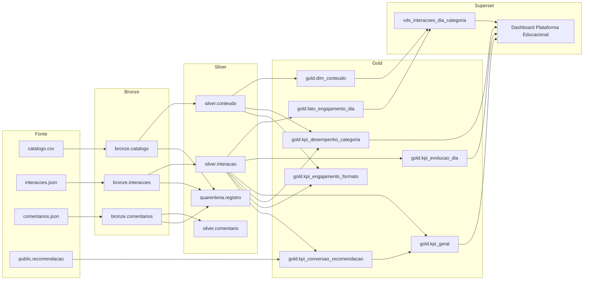

# Linhagem de dados (RF29)

A linhagem vai da fonte ao dashboard e está registrada no OpenMetadata (http://localhost:8585). O script `openmetadata/configurar_catalogo.py`, chamado por `scripts/07_openmetadata_catalogo.ps1`, grava 28 arestas na execução `carga-completa`.

## 1. Visão geral



## 2. O que é automático e o que é manual

| Trecho | Como entra no OpenMetadata |
| --- | --- |
| Tabelas e colunas de `bronze`, `silver`, `quarentena`, `qualidade`, `auditoria`, `gold`, `mestres` e `lgpd` | Ingestão automática do PostgreSQL (`openmetadata/ingestao/postgres.yaml`, usuário `om_catalogo`) |
| Dashboard, gráficos e datasets do Superset | Ingestão automática do Superset (`openmetadata/ingestao/superset.yaml`) |
| Arquivo bruto → Bronze | **Manual** (seção 4): o OpenMetadata não cataloga arquivos locais |
| Bronze → Silver → Gold | **Registrada pela API** (`configurar_catalogo.py`): as transformações rodam em pipelines do Hop e em funções SQL, que o OpenMetadata não interpreta. Cada aresta leva a descrição da transformação e o pipeline `apache_hop.orquestrador` |
| Gold → dataset virtual → dashboard | **Registrada pela API**, ligando as entidades do Superset já ingeridas |
| Parquet e Beam | **Manual** (seção 4): arquivos fora do banco |

## 3. Principais transformações

| Origem | Destino | Transformação |
| --- | --- | --- |
| `bronze.catalogo` | `silver.conteudo` | Hop `silver_conteudo`: padroniza tipo, categoria e nível, deduplica por `conteudo_id` e envia inválidos à quarentena |
| `bronze.interacoes` | `silver.interacao` | Hop `silver_interacao`: tipa datas e números, valida a faixa do percentual e a referência a `silver.conteudo`, deduplica pela chave de negócio |
| `bronze.comentarios` | `silver.comentario` | Hop `silver_comentario`: normaliza tags e valida nota de 1 a 5 e a referência ao conteúdo |
| `silver.interacao` | `gold.fato_engajamento_dia` | `gold.publicar`: `GROUP BY conteudo_id, data_hora::date`; conclusão é tipo `conclusão` ou percentual ≥ 100 |
| `silver.interacao` | `gold.kpi_geral.usuarios_ativos` | `COUNT(DISTINCT usuario_id)` (linhagem de coluna registrada) |
| `public.recomendacao` + `silver.interacao` | `gold.kpi_conversao_recomendacao` | Último lote de recomendação; convertida quando há interação do mesmo usuário com o mesmo conteúdo |
| `gold.fato_engajamento_dia` + `gold.dim_conteudo` | `vds_interacoes_dia_categoria` | Consulta 1 de `sql/sql_lab.sql` (junção fato x dimensão) |
| `silver.conteudo` | `mestres.conteudo_mestre` | `mestres.consolidar`: match por título normalizado + tipo + autor |
| `gold.dim_conteudo` | `lgpd.conteudo_publico` | `lgpd.atualizar`: autor mascarado e hash sha256 com salt |

## 4. Relações registradas manualmente

| Origem | Destino | Transformação | Evidência |
| --- | --- | --- | --- |
| `dados/brutos/catalogo.csv` | `bronze.catalogo` | Hop `bronze_catalogo`: leitura como texto e colunas de auditoria | `hop/pipelines/bronze_catalogo.hpl` |
| `dados/brutos/interacoes.json` | `bronze.interacoes` | Hop `bronze_interacoes` | `hop/pipelines/bronze_interacoes.hpl` |
| `dados/brutos/comentarios.json` | `bronze.comentarios` | Hop `bronze_comentarios` | `hop/pipelines/bronze_comentarios.hpl` |
| `silver.interacao` | `dados/gold/parquet/interacao/ano=AAAA/mes=MM` | `beam/pipeline.py`: exportação particionada por ano e mês | `beam/evidencias/medicoes.json` |
| Parquet de interação | `dados/gold/parquet/engajamento_dia/{direct,spark}` | Beam: mesma agregação da `gold.fato_engajamento_dia`, no DirectRunner e no Spark | `medicoes.json`: 997 linhas nos dois runtimes |

## 5. Como localizar a origem de um valor do dashboard

Exemplo: o cartão **Usuários Ativos** mostra **150**.

1. **Dashboard → gráfico.** No OpenMetadata, abrir o dashboard `Plataforma Educacional - KPIs e Recomendações` (serviço `superset_desafio`) e a aba *Lineage*. O dashboard aparece ligado a `gold.kpi_geral`, a tabela de onde o gráfico Usuários Ativos lê `MAX(usuarios_ativos)`.
2. **Gold → coluna.** Em `gold.kpi_geral`, a coluna `usuarios_ativos` tem o termo de glossário **Usuário ativo**, com a regra `COUNT(DISTINCT usuario_id)`. A linhagem de coluna aponta para `silver.interacao.usuario_id`.
3. **Silver → Bronze.** A aresta `bronze.interacoes → silver.interacao` descreve as regras aplicadas. Cada linha Silver guarda o `execucao_id`.
4. **Bronze → arquivo.** `bronze.interacoes` tem `arquivo_origem = interacoes.json` e `data_hora_ingestao` em todas as linhas.

Conferência em SQL, com o mesmo resultado do cartão:

```sql
SELECT usuarios_ativos FROM gold.kpi_geral;                    -- 150
SELECT COUNT(DISTINCT usuario_id) FROM silver.interacao;        -- 150
SELECT DISTINCT arquivo_origem, execucao_id FROM bronze.interacoes;
```

O mesmo caminho vale para o gráfico **Evolução Temporal de Interações**. Ele passa pelo dataset virtual `vds_interacoes_dia_categoria`, que o OpenMetadata mostra ligado a `gold.fato_engajamento_dia` e `gold.dim_conteudo`.
